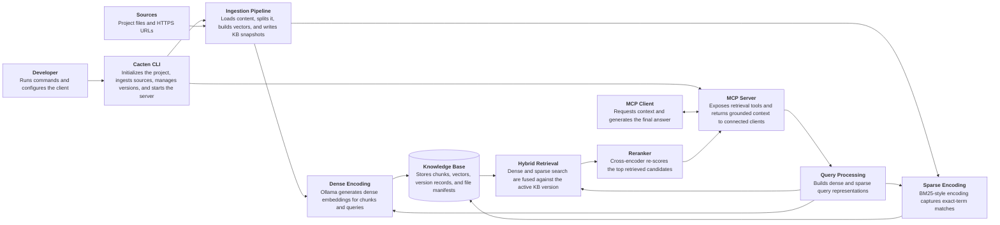

# Cacten Architecture

Short summary of the current system architecture.

For the deeper design reference, see [systems-design.md](systems-design.md).

---

## What Cacten Is

Cacten is a local-first retrieval layer for MCP-compatible coding agents and assistants.

It ingests project documents into a versioned knowledge base, retrieves relevant context with hybrid search plus reranking, and exposes that context through MCP. The connected client remains responsible for answer generation.

---

## Core Stack

- Python 3.12
- Typer for the CLI
- FastMCP for the MCP server
- Qdrant in local path mode for vector storage
- Ollama with `nomic-embed-text` for dense embeddings
- BM25 sparse encoding for exact-term retrieval
- FastEmbed cross-encoder reranking
- Pydantic v2 for internal models

---

## High-Level Flow

```text
Project files / URLs
  → load and normalize
  → split by content type
  → dense + sparse indexing
  → store in versioned local Qdrant collection

agent query
  → MCP tool call
  → dense + sparse query encoding
  → Qdrant hybrid retrieval
  → rerank top candidates
  → return <cacten_context> block
```

## High-Level Diagram



---

## Main Subsystems

### Ingestion

- Supports manifest-driven ingest and ad hoc ingest
- Creates one immutable KB version per ingest run
- Stores manifest provenance for manifest runs
- Reuses unchanged files during repeated manifest ingests

### Storage

- Qdrant stores chunk text, vectors, and metadata
- `versions.json` stores KB version metadata
- `version-files/<version-id>.json` stores per-file ingest metadata for incremental reuse

### Retrieval

- Dense retrieval captures semantic similarity
- Sparse retrieval captures exact technical terms
- DBSF fusion combines both
- A cross-encoder reranker improves final precision

### MCP server

- `search_personal_kb` returns retrieved chunks, not answers
- `cacten://personal_context` provides baseline developer context
- `--passthrough` allows side-by-side testing without RAG

---

## Storage Layout

```text
~/.cacten/
├── config.json
├── kb/
│   ├── qdrant/
│   ├── versions.json
│   └── version-files/
└── logs/
    └── sessions/

.cacten/
├── sources.toml
├── sources-example.toml
└── manifest-history/
```

---

## Architectural Principles

- Local-first by default
- Retrieval-only middleware, not a second answer generator
- Versioned knowledge-base snapshots instead of in-place mutation
- Thin CLI and MCP surfaces over explicit Python modules
- Practical quality improvements over novelty: hybrid retrieval, reranking, and incremental ingest

---

## Current Status

Implemented today:

- project-local manifest workflow
- incremental manifest ingest
- hybrid retrieval in Qdrant
- cross-encoder reranking
- MCP serving for compatible clients such as Claude Code
- session logging
