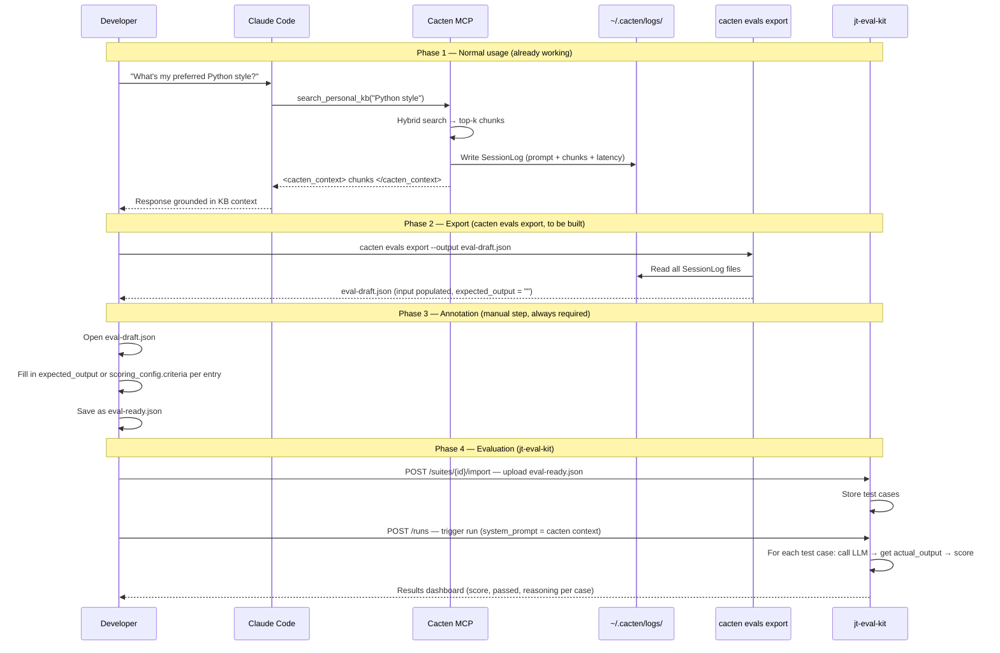
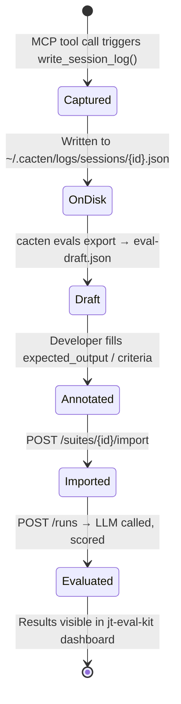
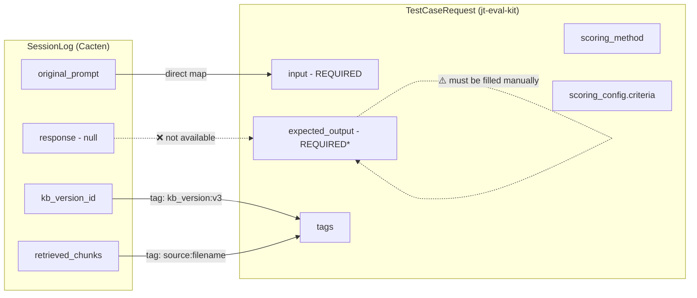

# Eval Integration Design — Cacten → jt-eval-kit

> Scratch doc for Phase 3 planning. Covers the full data flow, the `expected_output` problem, and the design of `cacten evals export`.

---

## The Core Problem

Cacten is a **retrieval system**. jt-eval-kit is an **evaluation system**. They speak different languages.

Cacten logs: *"I was asked X, I retrieved these chunks."*
jt-eval-kit expects: *"For input X, the correct output is Y."*

The gap is `expected_output` — a ground truth or rubric that describes what a good response looks like. Cacten doesn't generate responses (Claude Code does), and it has no way to know what "correct" means for a given query. That judgment has to come from somewhere else.

---

## System Roles

| System | Role |
|--------|------|
| **Cacten MCP server** | Retrieves KB context, injects into Claude Code, logs the event |
| **Claude Code** | Receives injected context, generates the actual response to the user |
| **`cacten evals export`** | Converts session logs into jt-eval-kit test case format |
| **jt-eval-kit** | Runs the LLM against test cases, scores responses, shows results |

**Key insight:** jt-eval-kit re-runs the LLM itself during eval. It takes your `input`, sends it to Claude with your `system_prompt`, and compares the output to your `expected_output`. It is not evaluating what Claude said during your session — it's evaluating what Claude *would say* given your KB context as the system prompt.

---

## Full Data Flow



---

## What Each Command Does

### Step 1 — Normal usage (already works)

```bash
# Ingest your KB
cacten ingest ./docs/preferences.md ./src

# Start MCP server (Claude Code calls this automatically)
cacten serve
```

Every time Claude Code calls `search_personal_kb`, Cacten writes a `SessionLog` to `~/.cacten/logs/sessions/{session_id}.json`.

**SessionLog written to disk:**
```json
{
  "session_id": "abc-123",
  "timestamp": "2026-04-01T10:00:00Z",
  "kb_version_id": "v3",
  "embedding_model": "nomic-embed-text",
  "original_prompt": "What is my preferred Python style?",
  "retrieved_chunks": [
    { "chunk_id": "...", "text": "Use type hints...", "source": "preferences.md", "score": 0.91 }
  ],
  "latency_ms": 142,
  "response": null,
  "model": null
}
```

Note: `response` is `null` — Cacten never sees what Claude actually said.

---

### Step 2 — Export session logs

```bash
cacten evals export --output ~/eval-draft.json
# or filter by date / kb version:
cacten evals export --since 2026-03-01 --kb-version v3 --output ~/eval-draft.json
```

**What `cacten evals export` does:**
- Reads all `SessionLog` files from `~/.cacten/logs/sessions/`
- Maps `original_prompt` → `input`
- Sets `expected_output: ""`
- Sets `scoring_method: "llm_judge"` as default
- Writes a JSON array (not JSONL — jt-eval-kit requires JSON array)

**Output `eval-draft.json`:**
```json
[
  {
    "input": "What is my preferred Python style?",
    "expected_output": "",
    "scoring_method": "llm_judge",
    "scoring_config": { "criteria": [] },
    "tags": ["kb_version:v3", "source:preferences.md"]
  }
]
```

---

### Step 3 — Annotate (manual, always required)

Open `eval-draft.json` and fill in each entry. Two patterns:

**Option A — Exact expected answer** (use for factual KB queries):
```json
{
  "input": "What is my preferred Python style?",
  "expected_output": "Type hints, Pydantic, PEP 8, Python 3.10+ patterns.",
  "scoring_method": "llm_judge",
  "scoring_config": { "criteria": [] },
  "tags": ["style", "python"]
}
```

**Option B — Rubric criteria** (use when the answer is open-ended):
```json
{
  "input": "What is my preferred Python style?",
  "expected_output": "",
  "scoring_method": "llm_judge",
  "scoring_config": {
    "criteria": [
      "Response mentions type hints",
      "Response mentions Pydantic",
      "Response mentions PEP 8",
      "Response does not recommend Java-style patterns"
    ]
  },
  "tags": ["style", "python"]
}
```

Option B is the more realistic path for a personal KB — you know what the KB *should* surface, so you define rubric criteria instead of a verbatim answer.

---

### Step 4 — Import to jt-eval-kit

```bash
# Create a suite in jt-eval-kit first (via the UI or API)
# Then import your annotated test cases:

curl -X POST http://localhost:8000/suites/{suite_id}/import \
  -F "file=@eval-ready.json;type=application/json"

# Response:
# { "imported": 12, "failed": 0, "suite_id": "..." }
```

---

### Step 5 — Run the eval

```bash
curl -X POST http://localhost:8000/runs \
  -H "Content-Type: application/json" \
  -d '{
    "name": "cacten-v3-eval",
    "project_id": "{project_id}",
    "suite_id": "{suite_id}",
    "system_prompt": "You are a helpful assistant with access to the developer personal knowledge base. Use the provided context to inform your responses.",
    "llm_model": "claude-sonnet-4-6",
    "pass_threshold": 0.70
  }'
```

**What jt-eval-kit does per test case:**
1. Sends `input` to the LLM with your `system_prompt`
2. Gets `actual_output`
3. Scores using your `scoring_method`:
   - `llm_judge` with criteria → Claude checks each criterion, returns 0.0–1.0 + reasoning
   - `exact_match` → case-insensitive string comparison
4. Marks `passed` if `score >= pass_threshold`

---

## State Diagram — Session Log Lifecycle



---

## Data Mapping — SessionLog → TestCaseRequest



> `expected_output` is marked REQUIRED by jt-eval-kit's schema but can be `""` when using `llm_judge` with `scoring_config.criteria`. The API accepts empty string — the LLM judge will evaluate against criteria only.

---

## What Needs to Be Built (E-1 / E-2)

| Task | Work |
|------|------|
| **E-1** | Confirm `expected_output: ""` is accepted by jt-eval-kit when `scoring_method: "llm_judge"` with non-empty criteria — smoke test against running jt-eval-kit instance |
| **E-2** | Build `cacten evals export` command: read session logs, map to `TestCaseRequest[]`, write JSON array to file |
| **E-2 flags** | `--output PATH`, `--since DATE`, `--kb-version ID`, `--limit N` |
| **E-3** | End-to-end smoke test: ingest → serve → retrieve → export → import → run |
| **E-4** | Document the eval workflow in README |

---

## Open Questions

| # | Question | Status |
|----|----------|--------|
| Q7a | Does jt-eval-kit accept `expected_output: ""` with non-empty `criteria`? | ⬜ Needs smoke test |
| Q7b | Should `cacten evals export` include `retrieved_chunks` as a serialized field in `tags` or a separate context field? | ⬜ Decision needed — useful for RAGAS-style faithfulness eval later |
| Q7c | Should the system prompt for eval runs include the retrieved chunks from the session, or just a generic KB description? | ⬜ Design decision |
