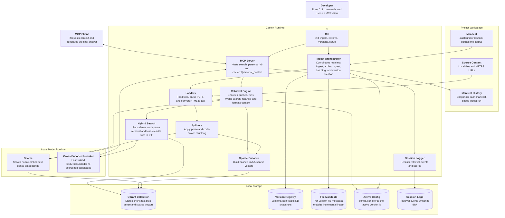
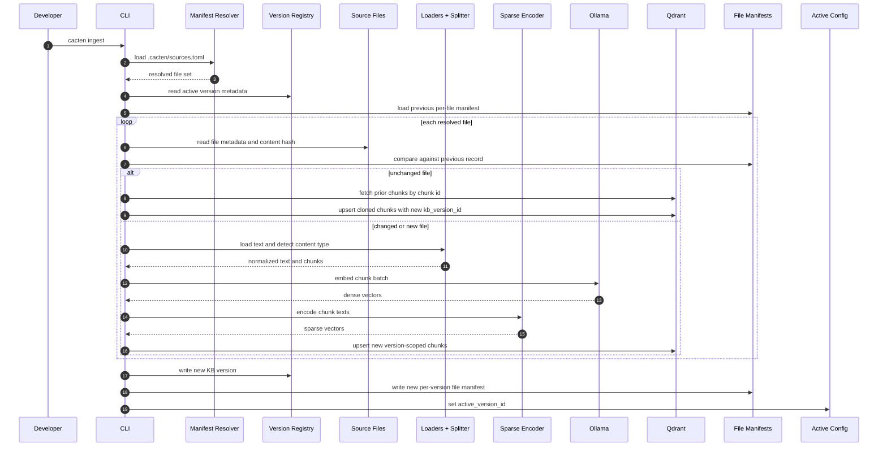
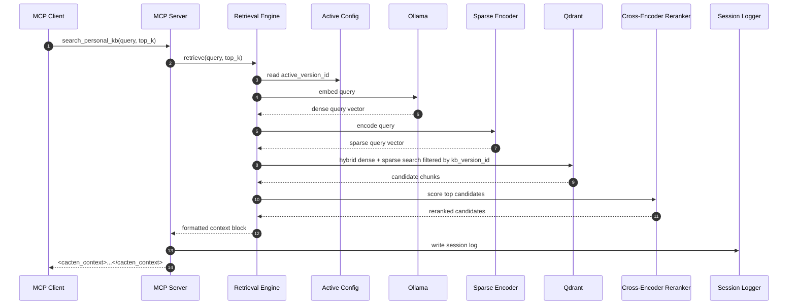

# Cacten — Systems Design

> Status: current as of April 12, 2026. Core ingestion, retrieval, incremental manifest ingest, reranking, version management, and MCP serving are implemented.

## Overview

Cacten is a local-first retrieval layer for MCP-compatible coding agents and assistants.

It does three things:

1. ingests project documents into a versioned knowledge base
2. retrieves relevant chunks with hybrid dense+sparse search and cross-encoder reranking
3. exposes that retrieval through MCP so a compatible client can request context on demand

Cacten does not generate answers. The connected MCP client remains the generator. Cacten's job is to provide grounded context quickly, locally, and predictably.

See [architecture.md](architecture.md) for the concise summary. This document is the deeper implementation-oriented reference.

---

## System At A Glance

```text
Developer
  │
  ├─ cacten ingest / cacten init / cacten versions ...
  │        │
  │        ▼
  │   Ingestion pipeline
  │   - load files / URLs
  │   - split by content type
  │   - dense embed with Ollama
  │   - sparse encode with BM25
  │   - upsert into local Qdrant
  │   - record KB version metadata
  │
  └─ cacten serve
           │
           ▼
      FastMCP server
      - search_personal_kb tool
      - cacten://personal_context resource
           │
           ▼
      MCP client / coding agent
      - decides when to call Cacten
      - receives context chunks
      - produces the final answer
```

## Runtime Component Diagram



## Manifest Ingest Sequence



## Retrieval And MCP Sequence



---

## Goals

- Keep all KB data local to the developer machine
- Make retrieval version-aware so corpus refreshes are traceable and reversible
- Support a project-local manifest workflow for repeatable ingest
- Improve retrieval quality with hybrid search and reranking
- Expose retrieval through MCP without wrapping a specific coding agent in another app layer

## Non-Goals

- Answer generation inside Cacten
- Multi-tenant or hosted serving in the current implementation
- Storage-level deduplication across KB versions
- Eval execution inside Cacten

---

## Current Architecture

### 1. CLI Layer

Typer provides the user-facing command surface:

- `cacten init`
- `cacten ingest`
- `cacten serve`
- `cacten retrieve`
- `cacten versions list`
- `cacten versions set-active`
- `cacten versions delete`

The CLI is intentionally thin. It validates inputs, prints operator-friendly output, and delegates to the ingestion, retrieval, versioning, and server modules.

### 2. Ingestion Pipeline

The ingestion pipeline supports two workflows:

- Manifest-based ingest: one KB version per `sources.toml` run
- Ad hoc ingest: one KB version per explicit source, or one per file when ingesting a directory

Manifest-based ingest is the primary workflow for real projects.

Pipeline stages:

1. resolve sources from `.cacten/sources.toml`
2. snapshot the manifest for provenance
3. compare current files against the previous active version's file records
4. reuse unchanged files by cloning prior chunks into the new version
5. fully reprocess changed and new files
6. write the new KB version record and per-version file manifest
7. mark the new version active

### 3. Storage Layer

Qdrant runs in local path mode under `~/.cacten/kb/qdrant`.

There is one logical collection. Chunks are scoped to a KB version through `kb_version_id` payload metadata rather than separate collections per version.

Version metadata is stored outside Qdrant in JSON:

- `~/.cacten/kb/versions.json`
- `~/.cacten/kb/version-files/<version-id>.json`

This split keeps vector search fast while preserving version- and file-level provenance in a straightforward format.

### 4. Retrieval Layer

Retrieval combines:

- dense embeddings from Ollama
- sparse vectors from a BM25 encoder
- Qdrant DBSF fusion
- a cross-encoder reranker

The flow is:

```text
query
→ dense embedding + sparse encoding
→ Qdrant hybrid retrieval
→ top 50 candidates
→ cross-encoder reranking
→ top k chunks
```

If reranking is unavailable at runtime, Cacten falls back to the hybrid search result set instead of failing the query.

### 5. MCP Server

FastMCP exposes retrieval through:

- tool: `search_personal_kb`
- resource: `cacten://personal_context`

The server uses stdio transport so an MCP-compatible client can launch it as a local subprocess. No network port is required in the current design.

---

## Technology Choices

| Area | Current implementation |
|---|---|
| Language | Python 3.12 |
| Packaging and tooling | `uv` |
| CLI | Typer |
| MCP server | FastMCP |
| Vector store | Qdrant local path mode |
| Dense embeddings | `nomic-embed-text` via Ollama |
| Sparse retrieval | BM25 encoder built with `rank-bm25` |
| Reranker | FastEmbed cross-encoder, `Xenova/ms-marco-MiniLM-L-6-v2` |
| Chunking | `langchain_text_splitters` |
| PDF parsing | `pypdf` |
| URL fetching | `httpx` |
| Data models | Pydantic v2 |
| Quality gates | Ruff, mypy strict, pytest |

### Why this stack

- Local-first operation matters more than cloud convenience for this project
- Qdrant supports dense+sparse hybrid retrieval cleanly in one store
- Ollama keeps embedding generation local and simple
- FastMCP matches the target integration model directly
- Typer and Pydantic keep the CLI and data contracts explicit without a lot of framework overhead

---

## Source Types And Loading

### Local files

Current supported extensions:

- `.py`
- `.ts`
- `.tsx`
- `.js`
- `.json`
- `.md`
- `.html`
- `.css`
- `.txt`
- `.pdf`

### URLs

- `https://...` URLs are supported
- HTML pages are reduced to plain text
- PDF responses are downloaded temporarily and parsed through the PDF loader
- `http://...` URLs are rejected

---

## Chunking Strategy

Cacten now uses content-type-aware chunking.

### Prose-like content

Markdown, text, HTML, CSS, PDFs, and other non-code content fall back to a recursive character splitter:

- chunk size: 512
- overlap: 64

### Code-like content

Supported code content types use LangChain's language-aware splitter:

- chunk size: 1024
- overlap: 128

Current code-aware mappings:

- Python
- TypeScript / TSX
- JavaScript / JSON
- Markdown
- HTML

This gives Cacten a better default shape for source code than the earlier "one splitter for everything" design.

---

## Embeddings And Retrieval

### Dense embeddings

- Model: `nomic-embed-text`
- Runtime: Ollama
- Dimensionality: 768

Dense embeddings are generated during ingest and for live queries.

### Sparse vectors

Cacten also builds a sparse representation for every chunk and query using a BM25-style encoder. Sparse vectors improve exact-term matching, especially for technical identifiers, filenames, and domain-specific wording.

### Hybrid search

Qdrant runs two retrieval paths in parallel:

- dense vector search
- sparse vector search

The results are fused with DBSF and filtered to the requested `kb_version_id`.

### Reranking

Reranking is enabled in the current system:

- model: `Xenova/ms-marco-MiniLM-L-6-v2`
- candidate count: 50
- fallback behavior: return hybrid results if reranking fails

This is the main quality layer after hybrid retrieval in the current system.

---

## Versioning Model

Every ingest produces a new immutable KB version.

Each version stores:

- version id
- version number
- creation time
- document count
- chunk count
- embedding model
- optional notes label
- manifest provenance for manifest-driven runs
- resolved file list for manifest-driven runs

### Manifest provenance

For manifest-based ingest, Cacten records:

- the live manifest path
- the snapshot path in `.cacten/manifest-history/`
- a manifest content hash
- the manifest schema version

### Per-version file manifests

Each manifest ingest also writes a JSON file describing every resolved source file in that version:

- absolute path
- content hash
- file size
- content type
- embedding model
- sparse encoder version
- chunk profile
- chunk count
- chunk ids

These records power incremental ingest.

---

## Incremental Manifest Ingest

Incremental ingest is implemented for manifest-driven workflows.

For each resolved file, Cacten compares the current file against the previous active version using:

- content hash
- content type
- embedding model
- sparse encoder version
- chunk profile

If those match, Cacten:

1. reads the prior chunk ids
2. fetches the prior chunks from Qdrant
3. clones them into the new `kb_version_id`
4. skips re-chunking and re-embedding

Tradeoff:

- compute is saved
- storage is not deduplicated across versions

That tradeoff is intentional in the current design because embedding cost is the bigger bottleneck.

---

## Data Models

### Chunk payload

Each stored chunk includes:

- text
- dense vector
- sparse vector
- chunk metadata

Chunk metadata includes:

- `chunk_id`
- `kb_version_id`
- `source_document_id`
- `source_url`
- `source_filename`
- `source_path`
- `source_file_hash`
- `chunk_index`
- `char_offset_start`
- `char_offset_end`
- `ingested_at`
- `content_type`

### Session log

Every successful `search_personal_kb` call writes a structured retrieval log containing:

- session id
- timestamp
- kb version id
- embedding model
- original prompt
- retrieved chunks
- latency
- optional `response`
- optional `model`

`response` and `model` remain unset today because Cacten does not observe the client's final answer.

---

## MCP Surface

### `search_personal_kb`

Purpose:

- retrieve relevant chunks for a query
- format them into a `<cacten_context>` block
- log the retrieval event

Behavior notes:

- returns a passthrough block when `cacten serve --passthrough` is enabled
- returns a helpful message if no active KB version exists
- returns an inline retrieval error block rather than crashing the server

### `cacten://personal_context`

Purpose:

- provide always-on developer context at session start

Current implementation:

- runs a fixed retrieval query for developer preferences and coding style
- returns a simple text block compiled from the top results

---

## Storage Layout

### User-level data

```text
~/.cacten/
├── config.json
├── kb/
│   ├── qdrant/
│   ├── versions.json
│   └── version-files/
│       └── <version-id>.json
└── logs/
    └── sessions/
        └── <session-id>.json
```

### Project-level data

```text
.cacten/
├── sources.toml
├── sources-example.toml
└── manifest-history/
    └── <timestamp>.toml
```

---

## Runtime Behavior And Failure Modes

### Ollama availability

- `cacten ingest` checks Ollama before running
- `cacten serve` warns if Ollama is unavailable but still starts
- retrieval raises a clear error on embedding-model mismatch across versions

### Cleanup on failed ingest

Manifest ingest cleans up partial version metadata and version-scoped vectors if a run fails after writing begins.

### Empty retrieval

If no relevant chunks are found, Cacten returns a valid but empty `<cacten_context>` block instead of failing the tool call.

---

## Current Limits

- stdio-only MCP transport
- single-user local workflow
- no eval export command
- no document removal command
- no storage-level chunk deduplication across versions
